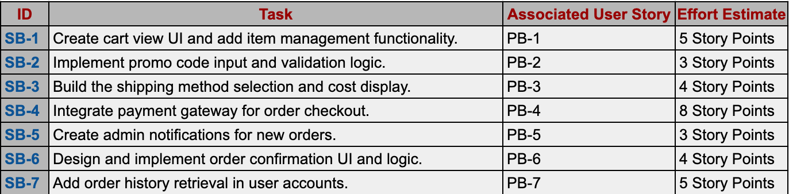

# Sprint Goal
** "Enable users to successfully place new orders with essential features like cart management, checkout, and order confirmation." **

This goal focuses on building and validating core functionalities that ensure a seamless order creation process, from cart to checkout, in the eCommerce app.

# Sprint BackLog

 